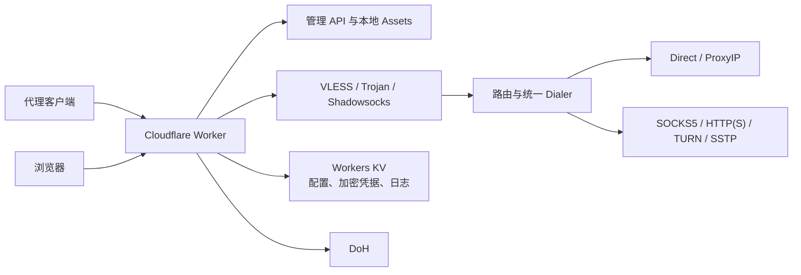

# EdgeTunnel

EdgeTunnel 是一个部署在 Cloudflare Workers 上的边缘网络隧道与代理订阅管理工具。Worker 同时提供代理数据面、本地管理后台、版本化 KV 配置和客户端订阅，不依赖 Cloudflare Pages Functions。

> 本项目仅用于合法的个人网络接入、研究和安全测试。请遵守所在地法律法规及 Cloudflare 服务条款。

## 能力矩阵

| 类别 | 支持能力 |
| --- | --- |
| 入站协议 | VLESS、Trojan、Shadowsocks AEAD |
| 传输 | WebSocket、gRPC、XHTTP stream-one |
| UDP | VLESS PacketAddr、XUDP DNS，通过 DoH 查询 |
| 出站 | Direct、ProxyIP、SOCKS5、HTTP CONNECT、HTTPS CONNECT、TURN TCP relay、SSTP |
| 路由 | 默认 profile、按入站/主机/端口匹配规则、私网目标阻止 |
| 订阅 | mixed、base64、Clash/Mihomo、sing-box、Surge |
| 管理 | HMAC 会话、revision 并发控制、加密代理凭据、订阅预览、有界脱敏日志 |
| 静态资源 | Worker Static Assets，本地 CSS/JS，无第三方运行时依赖 |

默认配置只启用 VLESS + WebSocket + Direct。Trojan、Shadowsocks、gRPC、XHTTP 和链式代理必须在后台显式启用。

## 架构



每个请求构造独立元数据和不可变 `RuntimeSnapshot`。代理凭据只以 AES-GCM 密文保存到 KV；管理会话和订阅令牌使用 HMAC-SHA-256。

## 必需资源

- 一个 Cloudflare Worker；
- 一个 Production KV namespace，binding 名固定为 `KV`；
- 如需分支预览，再创建一个独立 Preview KV；
- 五个 Worker Secret：

| Secret | 用途 | 要求 |
| --- | --- | --- |
| `ADMIN` | 后台密码、会话和订阅令牌根密钥 | 使用随机强密码 |
| `UUID` | VLESS 身份 | 必须是 UUID v4 |
| `CONFIG_KEY` | KV 代理凭据加密密钥 | 32 字节 base64url |
| `TROJAN_PASSWORD` | Trojan 入站密码 | 即使暂未启用也需配置 |
| `SHADOWSOCKS_PASSWORD` | Shadowsocks 入站密码 | 即使暂未启用也需配置 |

生成 UUID 和 `CONFIG_KEY`：

```bash
node -e "console.log(crypto.randomUUID())"
node -e "console.log(crypto.randomBytes(32).toString('base64url'))"
```

不要把实际值写入 Git、`wrangler.jsonc`、工单或日志。

## Cloudflare 控制台 Git 部署

Cloudflare Workers Builds 可以直接克隆 Git 仓库、安装依赖、检查并部署，无需先在本机编译。

1. Fork 或推送本仓库到自己的 GitHub。
2. 在 Cloudflare `Workers & Pages` 中选择 `Create application` → `Worker` → `Import a repository`。
3. 配置构建：

| 设置 | 值 |
| --- | --- |
| Production branch | 你的正式分支，例如 `main` |
| Build command | `npm run check` |
| Deploy command | `npx wrangler deploy --env=""` |
| Root directory | `/` |

4. 在 `wrangler.jsonc` 中核对 Production/Preview KV ID。
5. 在 Worker 的 `Variables and Secrets` 中添加五个 Secret。
6. 首次部署后先访问 `https://<worker>.<subdomain>.workers.dev/login`。
7. 登录 `/admin` 保存配置并预览订阅。
8. 在 `workers.dev` 完成代理验证后，再添加 Worker Custom Domain。

原 Pages 项目可以继续保留作为回滚环境，但同一个自定义域不能同时绑定 Pages 和 Worker。切换域名时只移除 Pages 的该域名绑定，不删除 Pages 项目。

## Wrangler 部署

```bash
npm ci
npm run check
npx wrangler whoami
npx wrangler deploy --env=""
```

Preview 使用独立 Worker 和 KV：

```bash
npx wrangler versions upload --env preview
```

Secret 应通过 Cloudflare 控制台或 Wrangler 的交互式输入设置。完整部署、切换和回滚步骤见 [Worker 运行手册](docs/worker-migration-runbook.md)。

## 使用

- 登录：`/login`
- 后台：`/admin`
- 管理 API：`/api/admin/v1/*`
- 订阅：`/sub?token=<HMAC_TOKEN>&format=<format>`
- 版本：`/version`
- 默认 WebSocket 路径：`/ws`

配置首次读取时会在 KV 的 `edgetunnel:config:v1` 初始化默认值。配置保存使用 `revision` 防止并发覆盖。代理 profile 的用户名和密码通过后台单独提交，不会出现在配置 JSON 中。

## 本地验证

```bash
npm ci
npm run check
```

`npm run check` 会生成 Worker 类型、执行 Node/Workers 测试、类型检查、ESLint、Prettier 和 Wrangler dry-run 构建。本地运行 Worker 时，将测试 Secret 放入未提交的 `.dev.vars`。

## 安全与运维

- [安全说明](docs/security.md)
- [部署与回滚手册](docs/worker-migration-runbook.md)
- [当前 E2E 结果](docs/e2e/worker-preview-results.md)
- [设计文档](docs/design/2026-07-29-standalone-worker-proxy-design.md)

## 鸣谢

项目的数据面实现参考并延续了原 edgetunnel 社区及 Cloudflare Worker 代理生态中的实践，包括 zizifn/edgetunnel、EDtunnel、cloudflare-worker-vless-ip、CF-Workers-HTTPS、CF-Workers-TURN、CF-Workers-SoftEther 等项目和贡献者。

## 免责声明

本项目不保证适合任何特定用途。使用者应自行承担部署、网络访问、账号安全和合规责任；作者及贡献者不对滥用或由此产生的直接、间接损失负责。
